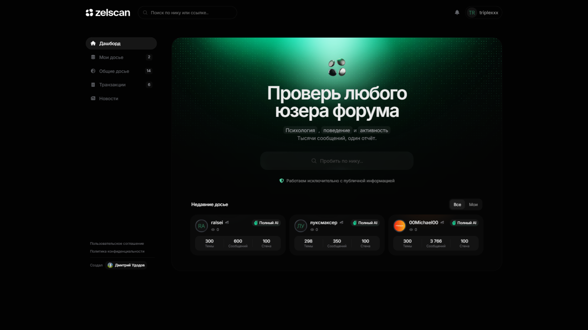
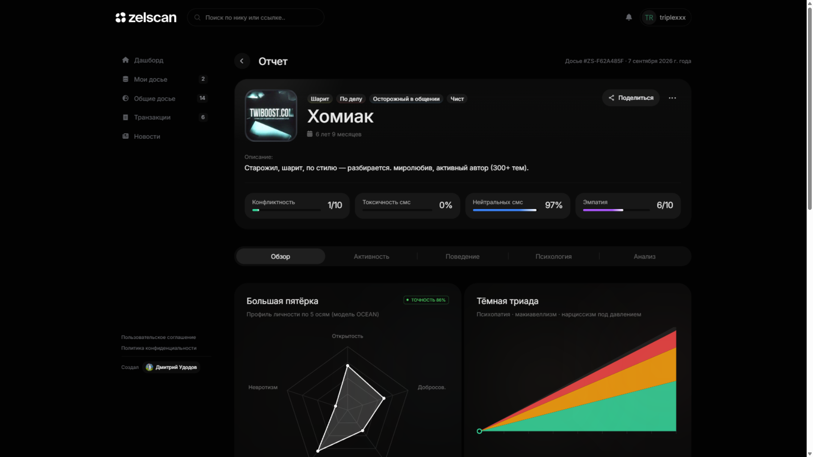
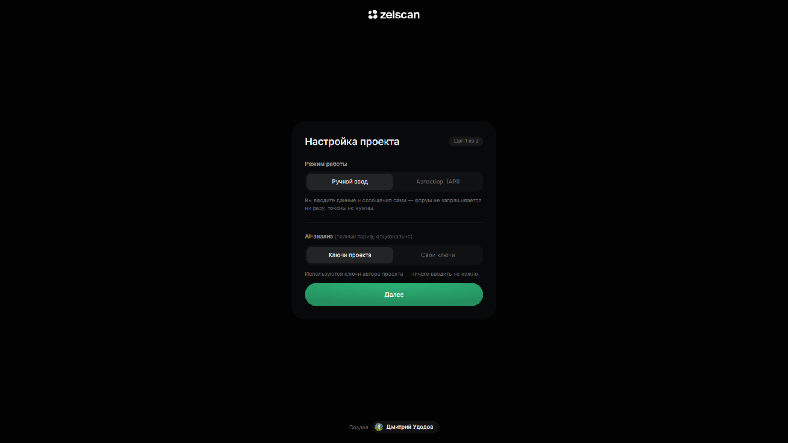

<p align="center"></p>

<h3 align="center">Досье на любого юзера LolzTeam — локально и бесплатно</h3>

<p align="center">
  
  
  
  
</p>

---

Zelscan анализирует публичную активность профиля на форуме lolz.team и собирает
полное досье: активность, поведение, стиль общения, репутацию и психологический
портрет аккаунта. Работает целиком на вашем компьютере, все отчёты бесплатны,
ваши ключи никуда не отправляются.

<p align="center"></p>
<p align="center"><i>Дашборд: поиск по нику, витрина готовых досье</i></p>

## ✨ Возможности

- **Два режима работы** — ручной ввод (без единого запроса к форуму) или автосбор через официальный API по вашим токенам
- **Полное досье** — обзор, активность, поведение, психология (Big Five, тёмная триада, эмоциональный интеллект), AI-аналитика
- **Матрица отношений** — как юзер общается с равными, новичками, модерацией и «слабыми»
- **Витрина отчётов** — публичные ссылки, история версий, автограф автора
- **Всё локально** — 0 ₽, никаких серверов автора, ключи хранятся только у вас
- **Открытая админка** — в локальной версии любой пользователь получает полный доступ к панели

<p align="center"></p>
<p align="center"><i>Готовое досье: метрики, архетипы, психологический портрет</i></p>

## 🚀 Установка

Нужен только [Python 3.10+](https://www.python.org/downloads/).

```bash
git clone https://github.com/koteika8d7-design/zelscan.git
cd zelscan
pip install -r requirements.txt

# два окна терминала:
python app/server.py         # backend  → http://localhost:5050
python app/front_server.py   # frontend → http://localhost:8080
```

Откройте **http://localhost:8080** — запустится мастер первоначальной настройки.

<p align="center"></p>
<p align="center"><i>Мастер настройки: режим, ключи, вход через форум</i></p>

## ⚙️ Первоначальная настройка

Мастер проведёт по двум шагам: **режим + AI** → **вход через форум (OAuth)**.

### Режим работы

| | Ручной ввод | Автосбор |
|---|---|---|
| Запросы к форуму | **ноль** | официальный API |
| Что нужно | ничего | LZT API-токены (лучше 3+) |
| Кому подходит | быстрый портрет по своим данным | полное досье по нику |

LZT API-токены: [lolz.team → Настройки → API](https://lolz.team/account/api) →
создать токен с правами на чтение профиля и поиска. Каждый вставленный токен
проверяется живым запросом.

### AI-анализ

По умолчанию используются **ключи проекта** — ничего вводить не нужно. Можно
вставить свои: [AKI.IO](https://aki.io) и/или [OpenRouter](https://openrouter.ai)
(free-модели).

### Вход через форум (OAuth) — обязательно

1. Откройте [lolz.team → Настройки → API](https://lolz.team/account/api) → создать приложение
2. Название — любое, например `Zelscan Local`
3. Redirect URI — `http://localhost:8080/oauth/callback` (скопируйте точно)
4. Разрешённые домены — `*` (звёздочка)
5. Вставьте Client ID в мастер → «Проверить» → «Завершить настройку»

## 📖 Использование

1. Войдите через форум
2. В поиске найдите пользователя → «Собрать досье»
3. На втором шаге выберите источник: **Автосбор (API)** или **Ручной ввод**
   (ник, статистика, сообщения — по одному в строке)
4. Тариф любой — всё стоит **0 ₽**; «Полный» добавляет AI-разбор личности
5. Готовое досье: разделы, публичная ссылка, история версий

## 🗂 Структура проекта

```
app/          backend (Flask) + фронт-сервер + визард настройки
landing/      страницы приложения (дашборд, отчёты, setup)
scripts/      ядро анализа (lolz_analyzer) и AI-интерпретатор
cache/        результаты отчётов (создаётся при работе)
zelscan.db    заказы, пользователи, история (создаётся при работе)
docs/         лого и скриншоты
```

## ⚠️ Важно

Автоматизированный сбор данных форума регулируется правилом **2.28** LolzTeam:
парсинг без разрешения администрации запрещён, разрешение выдаётся персонально.
Используя режим автосбора, вы сами отвечаете за соблюдение правил — ручной
режим не затрагивает форум вообще. AI-выводы — вероятностная интерпретация
текстов, а не медицинское заключение.

## 📄 Лицензия

[MIT](LICENSE) — используйте свободно.

<p align="center"><sub>Сделано <a href="https://t.me/udodov228">Дмитрием Удовым</a> · Zelscan</sub></p>
